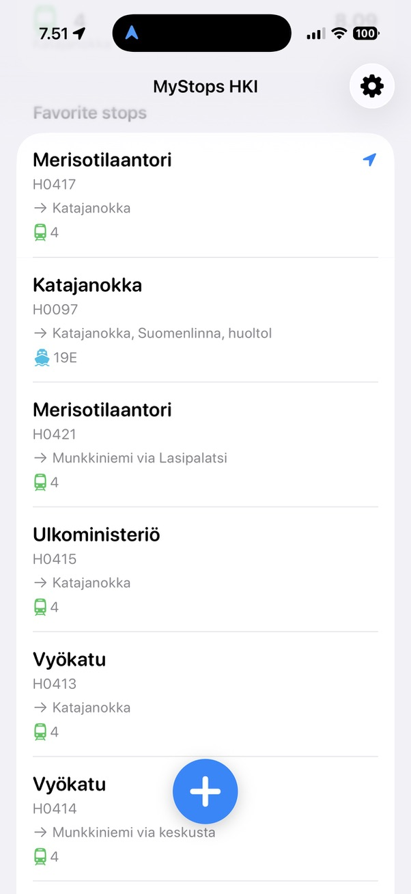
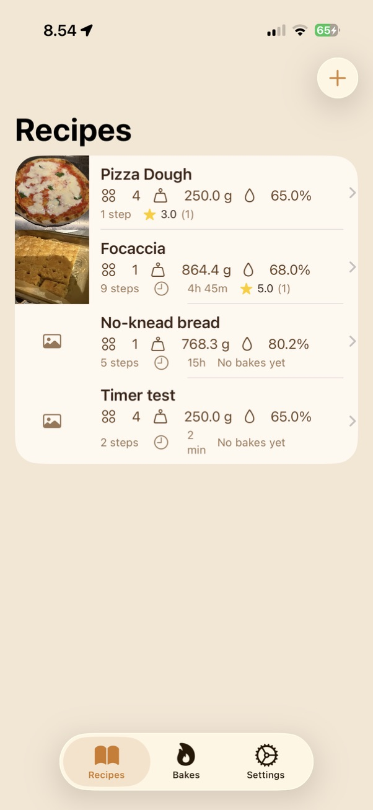
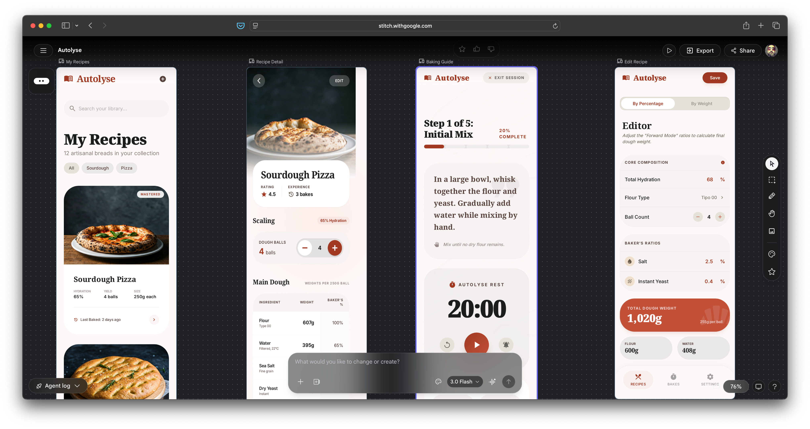
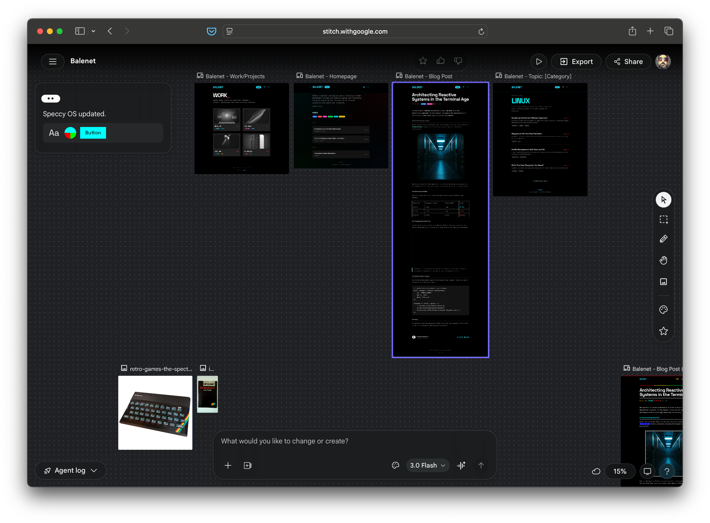
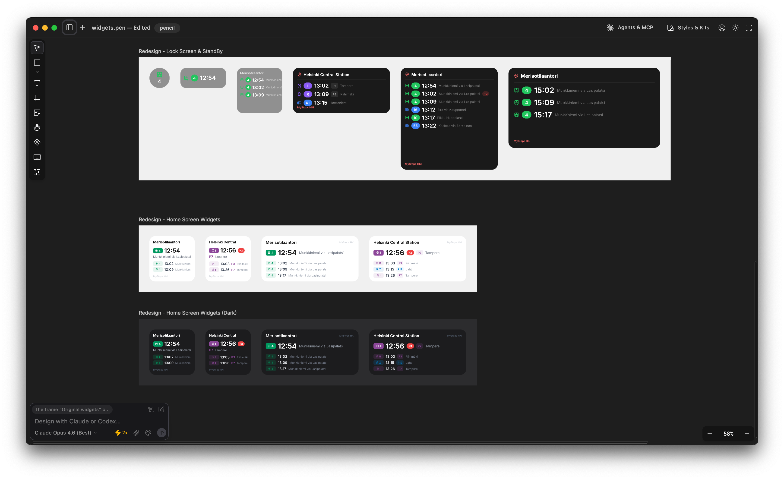

It's been almost two years since I [posted about using AI to design an app](https://balenet.com/posts/ai-designed-this-app/). As with everything else with AI, things have evolved a lot since then. However while coding with AI is mostly a solved problem, design seems to be still in its infancy, especially for native mobile applications. Here are a few approaches I tried recently, and what worked for me.

## Put it in words

When I developed my first iOS application using AI, I just described to the agent how I wanted it to look like, using words like "minimalistic" and "easy to use". The result was a standard SwiftUI application that looked nice but also generic. I also used words to describe the first version of my (this) website, and that worked better, and the same for my company site, [Baleware](https://www.baleware.com). In general AI agents seem to do better at web design than native.

## Copy with shame

I follow a few Youtubers that talk about AI-assisted development. In one video, the author described the following workflow:

* Look for a design you like on [Dribbble](https://dribbble.com)
* Take screenshots, give them to an AI agent and tell it to create a design system (a textual document that describes the design, wiht colors, margins etc.)
* Refer to the design system in the prompt

I tried this for my pizza calculator and got something that was OK but not great. It also felt too much like ripping off other people's work. If I were a designer, I wouldn't put my design on Dribbble.

## Google Stitch

Last week Google released a new version of [Stitch](https://stitch.withgoogle.com), a design tool similar to Figma that got some new AI capabilities. Basically you give it a prompt (including reference images) and it creates a design that you can then edit and give to a coding agent via MCP. I used it again for my pizza app and it created very nice designs that look like a high end recipe app. The screens are backed by HTML which makes it easy to the coding agent to parse and understand. I also used it to redesign my website, which it did excellently. The only thing it did poorly was designing a lock screen widget for iOS.

Stitch is in Beta and free, although who knows for how long.

## Pencil

Just when I thought that Stitch was perfect, I found [Pencil.dev](https://www.pencil.dev). The idea is similar to Stitch but it's a desktop application. I like the interface better, especially the fact that you see what the agents are designing in real time. The only downside is that it's limited to Claude models at the moment, which tend to perform worse in "creative" tasks where Gemini is better. However it did much better than Stitch on widget design and I used it to give a glow-up to my public transport widget.

Pencil lets you use your own API key to access the AI model , and other than that it's free. I don't understand how the team makes money but hey, who am I to complain. It did burn a lot of my Claude tokens with just two agents, so I hope they get a commission from Anthropic.

## What about skills?

I haven't tried any design skills in Claude Code yet. Surprisingly, there is no iOS design plugin in the Claude marketplace, although there is a SwiftUI skill by Paul Hudson which however seems to be more about coding.

Side note, while I was writing this I discovered the Superpowers plugin and got really excited, until I realised it was burning 5x more tokens than normally.

## Closing the loop

When iterating with AI, it's important to give the agent feedback about what it has built. So far I've resorted to taking screenshots myself and passing them to the agent, but a better way would be to let it do it itself using MCP. For web development Chrome has an MCP server. For iOS, Xcode 26.3 has one too, but for that I need Xcode 26.3, which needs MacOS 26 which... based on my past experience with OS updates, I don't date to install.

## In conclusion

There is a lot happening in the design space and new tools appear every week. As usual, it's hard to keep pace. Unlike code, design is something that your users see, so it's important to make it personal to stand out. I'm going to use Pencil until something better comes out, and maybe Stitch on occasion to get different creative input.
