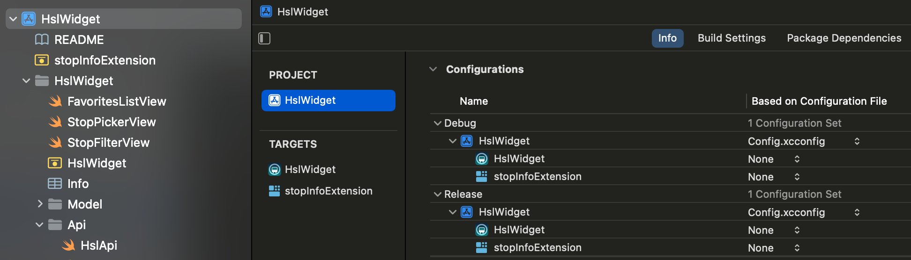

Recently I started working again on my [iOS lockscreen widget for public transports timetables](https://github.com/baleboy/hsl-widget). I paired with Claude Code instead of ChatGPT Codex this time to see how much different it would be, and also because according to reviews it has slightly better results in coding tasks.

I can confirm that Claude Code works really well, although it is very hard to say whether it’s better than Codex or not, as the whole experience is very similar. I was a bit skeptical about using Claude for iOS development because of how tightly the workflow is integrated with XCode, but actually it is very easy to let Claude edit files side by side with Xcode, and use the latter for building and testing. Claude can use the command line Xcode build tools to check that the code builds correctly and make fixes independently, and thanks to it I have been able to add many features in a matter of a few days that would otherwise have taken me weeks. Claude even created an icon for me, although it’s butt-ugly. 

In fact I’ve been so productive and are committing features so frequently, that the manual “build - test on device - publish to Testflight” (yes I have a beta user) cycle has become a bottleneck, so I decided to step into unknown territory and set up a workflow to publish new Testflight builds for every commit to main. I was a little scared at first because I’ve never done something like this for iOS, but actually thanks to Claude again I had the whole thing set up within a day, using Fastlane for building and a Github Action to run the workflow. Among other things, this enables the “couch coding” (also known as “toilet coding”) approach based on Claude Code Web that I found so exciting while updating my website, but I haven’t had the chance to try it with this project yet.

Surprisingly however, Claude had problems fixing a relatively small thing, which is the focus of this post. To speed things up I had committed my Digitransit API key to git, which is a blatant security risk of the type that ends up on Twitter as a cautionary tale about the dangers of vibe coding. I asked Claude to fix this for both local and cloud builds, and it failed miserably. After many back and forths it was able to succeed for the local build, but it just couldn’t make it work in the Github workflow. I think part of the reason is that Claude doesn’t have access to the cloud build and therefore can’t iterate as effectively, and also that the configuration involves making changes via the XCode UI and is not as well supported by the command line. But the biggest reason might be that I just had no idea of what needed to be done and was entering pure vibe coding territory, which made me feel extremely anxious. So I resolved to do it myself and learn something in the process.

## The overall process

The steps are actually quite simple:

1. Create an XCode config file with the API key and keep it out of version control
2. Read the API key into an Info.plist variable
3. Read the variable from code
4. For the cloud build, store the API key as a repository secret and generate the Config file at build time using the store key

Because the config file is not committed, the key stays in either your local machine or the Github secret.

Claude followed these steps, but after the first failures it began messing about with the config file and I felt like I was losing control. After I understood the process it was easier to direct it to more specific tasks (like how to generate the .xcconfig in Github Actions) that it could get right.

## Configuring the key in XCode

I created the Config.xcconfig using XCode’s “File/New file from template…”:


I then added the config file to both Debug and Release builds for all targets:



Finally I added the key as an Info.plist property for both targets:


And initialized it in the code:

```
class HslApi {
    
    static let shared = HslApi()

    static var apiKey: String? {
        guard let apiKey = Bundle.main.object(forInfoDictionaryKey: "HSL_API_KEY") as? String else {
            fatalError("Could not read HSL API Key from Info.plist")
        }
        return apiKey
    }
```

I needed the key in both targets because it is accessed by a singleton used by both the app and the widget, and it’s impossible to say which one will get to it first and initialize it. This duplication is annoying, but I couldn't find a straightforward way to avoid it so I decided to live with it.

## Configuring the key in the Github action

Finally, I added the key to the repository as a secret, and a step to the Github Action to generate `Config.xcconfig` before building:

```
 - name: Create Config.xcconfig
    run: |
      echo "HSL_API_KEY = ${{ secrets.HSL_API_KEY }}" > HslWidget/Config.xcconfig
```

After pushing to main I could see that everything worked properly and I could now retire my compromised key and update the workflow with a new one!

## But is it secure?

Well, not really. As it is, the key is stored within the application binary and can be extracted with enough effort. Frankly if someone wants to go through all that to get my Digitransit API key, they are welcome to it. But if the key in question was related to e.g. payments then it would be a whole other matter.

I haven't done this myself nor have I seen it done, but as far as I know the best way to protect the key is to keep it in a server that acts as a gateway towards the API, and have the application authenticate itself with that server (how I'm not sure but that's for another time).
