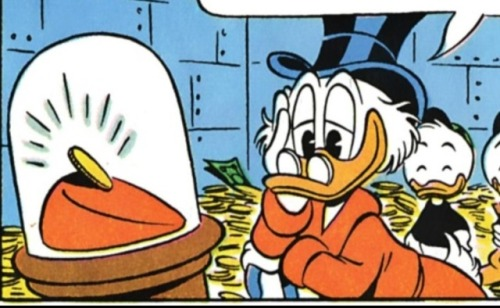
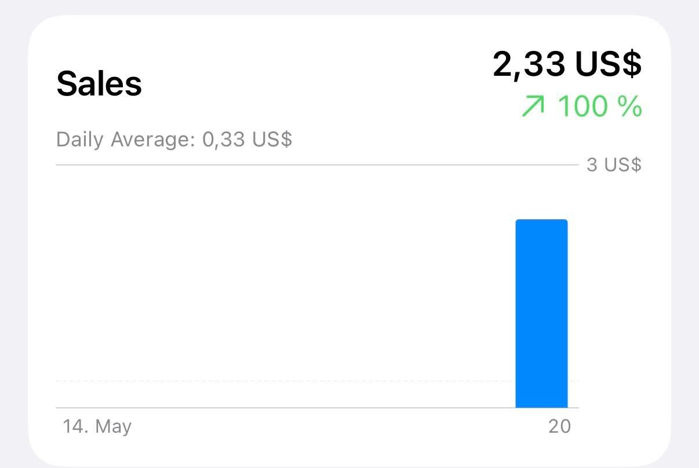
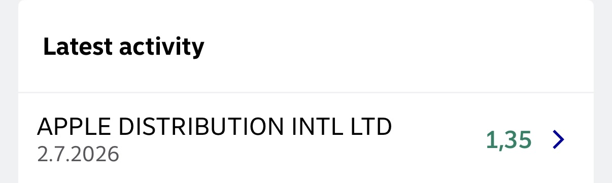

A few months ago I released my [Helsinki public transport widget](https://apps.apple.com/fi/app/mystops-helsinki/id6740795365) to the Apple App Store. It's a niche utility app that I did for myself and my friends, and I never fooled myself into thinking that I could make money out of it. But as an experiment, I added an in-app purchase to unlock unlimited number of favorite stops. 

Lo and behold, although the app has less than 100 users someone actually paid for it! In another time I would have framed this first "Dollar" and put it up on the wall, but in this day an age the best I can do is post evidence of the financial transaction here:

