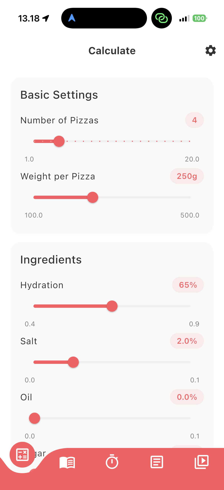
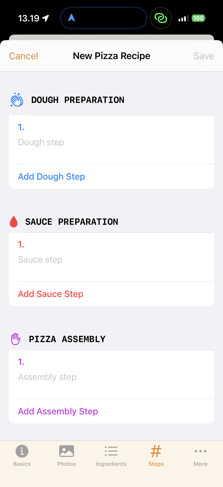

Ever since I got into pizza making and baking, I have looked for the best calculator to help me craft the perfect dough. I created [my own](https://pizzalab.firebaseapp.com) almost ten years ago and continue using it to this day, but lately I’ve felt that it’s in need of an update. However, before spending too much time on it I wanted to check what’s available in the App Store to see if I could get away with one of the existing calculators. It turns out that baking calculators are a dime a dozen! I counted 23 but there are probably more. It seems that any engineer who gets started with pizza making ends up with the conclusion that the world needs another pizza app. So before joining the crowd I decided to test them all (even the paid ones!) to figure out which one is the best, and here is what I found.

And before I get to the actual apps let me just say this one thing: there is absolutely no need to pay for a pizza calculator in 2025. Not only the best apps I tested are free, but the paid ones are from terrible to mediocre. 

## The best: Napo

[Napo](https://www.napo.pizza) is much more than a calculator and is by far the best pizza application I have found in the App Store. First of all, it has a cute and polished UI. The calculator itself is very clear and simple, perhaps too simple because it only has a predefined list of ingredients, though it does have an option for a pre-ferment. 

Napo clearly separates the creation of the recipe with the actual baking, for which it has a clear step-by-step workflow with reminders. It has an extensive catalog of recipes, including my go-to recipe from Tony Gemignani’s Pizza Bible. And it has a journal to record the outcome of each baking session. Finally, although I am only interested in iOS apps, it’s worth mentioning that Napo has an Android version coming up and [currently under test](https://www.reddit.com/r/AndroidClosedTesting/comments/1mp1po1/napo_your_pizza_companion_is_looking_for_testers/).

My only complaint about Napo is that it is optimized for the built-in recipes, but doesn’t seem to have as many options for the user’s own recipes. This is probably done to reduce the complexity of the recipe editor, but limits the usefulness for pizza geeks like myself. But perhaps I have not fully understood how to use it, because the available recipes seem to be submitted by different users.

Napo is free and doesn’t have any ads. I don’t understand how the developer supports an app of such a level without making money out of it. There is a restaurant locator in the app and I can imagine that it could be a source of revenue, but at least in Helsinki only shows one pizzeria.

## The runner ups

These are other apps that I thought were very good.

### Pizza Calculator Pro

[Pizza Calculator Pro](https://apps.apple.com/fi/app/pizza-calculator-pro/id6745489175) is another great free app with similar functionalities as Napo. In fact I would be pressed to say which one is best, but in the end Napo was my favorite because of the UI and the journal functionality.

### Za

Aside from the odd name, [Za](https://apps.apple.com/fi/app/pizza-recipe-journal-za/id6746828561) has a great recipe editor (including sauces) and a pantry/shopping list function that the others are missing. There is a paid subscription that promises an advanced calculator, but I didn’t try it.

### Ooni

This is the [official application](https://apps.apple.com/fi/app/ooni-pizza-ovens/id1043854726) for the Ooni pizza ovens, but it works just as well even if you don’t have one. It has a rich catalog of recipes including sauces and toppings and basically anything else you can cook in an Ooni, which makes it a bit cluttered. The calculator itself is pretty standard fare with a clean UI.

## In conclusion

Sadly, none of the 23 applications I tried lets me enter a recipe by weight, which is something I need to add recipes I find in books etc. So in spite of all the free greatness, I am still going to create my own. I started a new project here, aptly named [YADC - Yet Another Dough Calculator](https://github.com/baleboy/YADC). More on it later!
